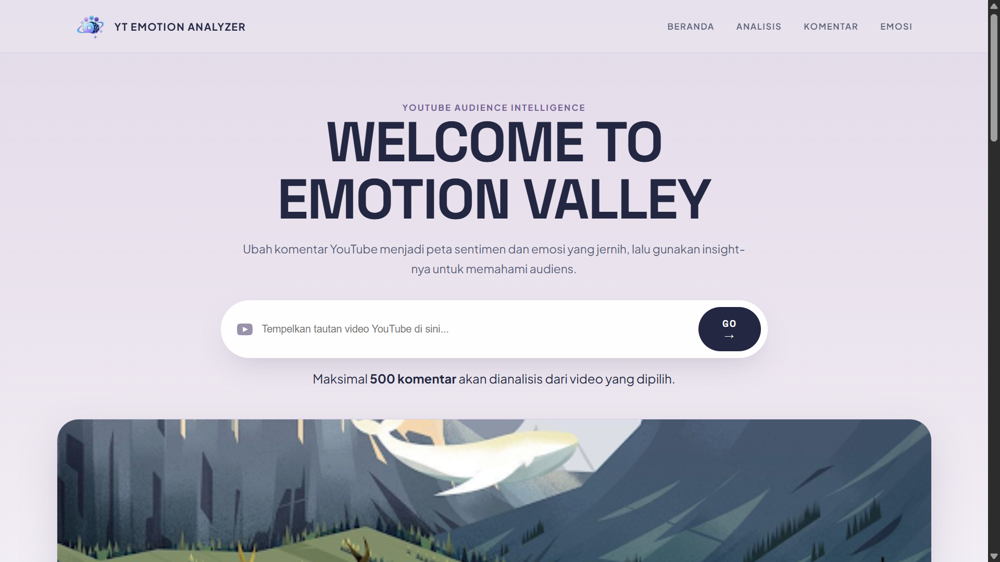

<h1 align="center">
    YouTube Emotion Analyzer (AI-Based)
</h1>

<p align="center">


</p>

---

# 📌 About

**YT Emotion Analyzer** is a web-based AI/NLP application that analyzes audience reactions from YouTube comments.

Simply enter a **YouTube video URL**, and the system retrieves available comments and transforms them into meaningful analysis.

The project focuses on answering:

> **"What are people actually saying about this video?"**

Instead of manually reading hundreds of comments, users can quickly understand the audience through sentiment, emotions, discussion topics, and AI-generated insights.

---

# ✨ Features

## 🎥 YouTube Video Analysis

Retrieve information from a YouTube video, including:

- Video title
- Thumbnail
- Like count
- Comment data
- Video metadata

### 📊 Sentiment Analysis

Classify comments into:

- 🟢 Positive
- ⚪ Neutral
- 🔴 Negative

The current implementation uses **TextBlob polarity** for sentiment analysis.

### 😊 Emotion Analysis

Identify emotions expressed in comments, such as:

- 😄 Joy
- ❤️ Love
- 😮 Surprise
- 😢 Sadness
- 😡 Anger
- 😨 Fear

### 🧠 AI Audience Insights

Go beyond sentiment and emotion analysis.
The AI insight layer is designed to understand what viewers are actually talking about.

It can identify:

- 🏷️ Main topics
- 🔁 Common themes
- 👍 What viewers like
- ⚠️ Common concerns
- ❓ Frequently asked questions
- 📝 Overall audience summary

Instead of simply repeating individual comments, similar comments can be grouped into meaningful patterns.
### 🔄 How It Works
```step by step analisis
YouTube Video URL
        ↓
YouTube Data API
        ↓
Collect Comments
        ↓
Text Preprocessing
        ↓
NLP / AI Analysis
        │
        ├── Sentiment Analysis
        ├── Emotion Classification
        ├── Topic / Theme Analysis
        └── Audience Insights
        ↓
Interactive Dashboard
        ↓
CSV / Excel Export
```

### 🧠 AI Audience Insights

The main idea behind this feature is:
```
Sentiment Analysis
        ↓
"How do viewers feel?"

Emotion Analysis
        ↓
"What emotions appear?"

Audience Insights
        ↓
"What are viewers actually talking about?"
```

### 📈 Dashboard 

The interface follows a YouTube Analytics × AI Intelligence concept.

<p align="center">
  
</p>

## 🛠️ Tech Stack
- Tailwind CSS
- JavaScript
- Chart.js / Data Visualization
- Backend
- Python
- Flask
- YouTube Data API
- AI / NLP
- TextBlob
- Hugging Face Transformers
- DistilBERT Emotion Model
- AI / LLM for Audience Insights
- Data Export
- CSV
- Excel

### 🏗️ System Architecture

``` struktur
                    ┌───────────────┐
                    │     USER      │
                    └───────┬───────┘
                            ↓
                    ┌───────────────┐
                    │ React + Vite  │
                    │   Frontend    │
                    └───────┬───────┘
                            │
                         HTTP/JSON
                            │
                            ↓
                    ┌───────────────┐
                    │ Python Flask  │
                    │    Backend    │
                    └───────┬───────┘
                            │
              ┌─────────────┴─────────────┐
              ↓                           ↓
       ┌───────────────┐          ┌────────────────┐
       │ YouTube API   │          │    NLP / AI    │
       └───────┬───────┘          └───────┬────────┘
               │                          │
               │              ┌───────────┼───────────┐
               │              ↓           ↓           ↓
               │         Sentiment     Emotion    AI Insights
               │         TextBlob     DistilBERT      LLM
               │              │           │           │
               └──────────────┴───────────┴───────────┘
                              ↓
                     ┌─────────────────┐
                     │ Analysis Result │
                     └────────┬────────┘
                              ↓
                     ┌─────────────────┐
                     │ React Dashboard │
                     └─────────────────┘
```

## Link Website

``` webiste


```

## ⭐ Support
If you like this project, consider giving it a **star ⭐ on GitHub!**
